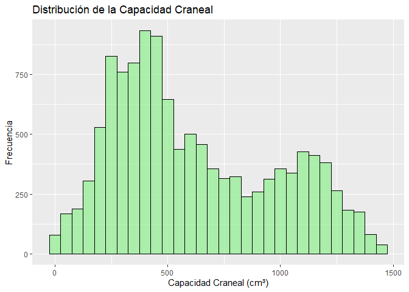
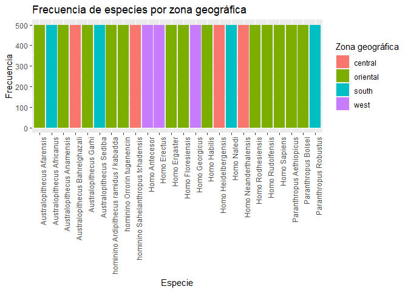
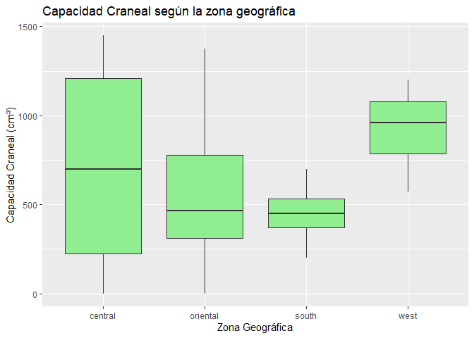
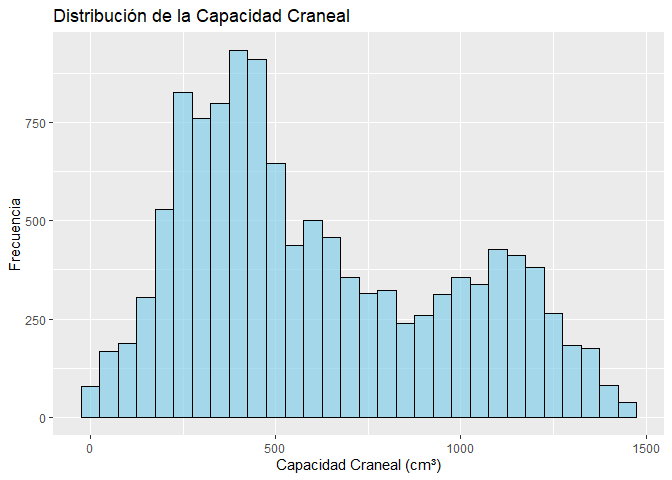
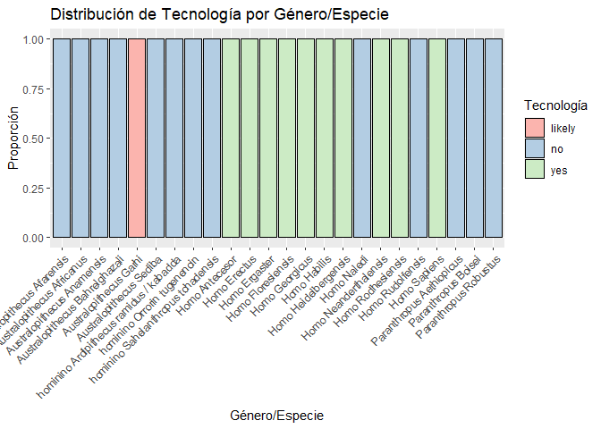
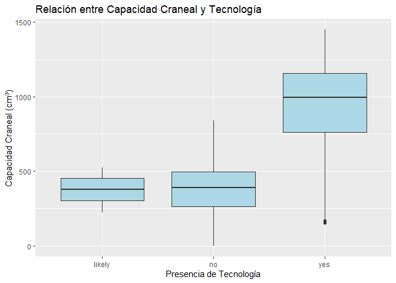
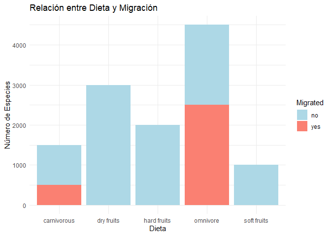

Los antepasados humanos
================
Isabel Poyato Sequeira <b12posei@uco.es>, Ana Ridruejo Luque
<b12rilua@uco.es>
2024-12-14

- [1. Contexto e Importancia](#1-contexto-e-importancia)
- [2. Objetivos](#2-objetivos)
- [3. Análisis conjunto de datos](#3-análisis-conjunto-de-datos)
- [4. Hipótesis](#4-hipótesis)
- [**4.1. Hipótesis 1:La capacidad craneal de las distintas especies de
  homínidos presenta variaciones significativas en función de la zona
  geográfica en la que
  habitaron.**](#41-hipótesis-1la-capacidad-craneal-de-las-distintas-especies-de-homínidos-presenta-variaciones-significativas-en-función-de-la-zona-geográfica-en-la-que-habitaron)
- [**4.2. Hipótesis 2**: **Las especies de homínidos con mayor capacidad
  craneal eran más propensas a desarrollar tecnologías
  avanzadas.**](#42-hipótesis-2-las-especies-de-homínidos-con-mayor-capacidad-craneal-eran-más-propensas-a-desarrollar-tecnologías-avanzadas)
- [**4.3. Hipótesis 3: La migración de especies se asocia con cambios
  significativos en la
  dieta.**](#43-hipótesis-3-la-migración-de-especies-se-asocia-con-cambios-significativos-en-la-dieta)
- [Conclusiones](#conclusiones)
- [Referencias](#referencias)
- [Información de la sesión](#información-de-la-sesión)

## 1. Contexto e Importancia

La **evolución humana** es uno de los campos más fascinantes y complejos
de la biología, que nos **permite entender cómo los seres humanos
modernos hemos llegado a ser lo que somos hoy**. Este proceso evolutivo
está marcado por una serie de adaptaciones, cambios morfológicos y
comportamentales que nos distinguen de otros primates. En este contexto,
**el análisis de los homínidos**, nuestros ancestros y parientes más
cercanos, **juega un papel fundamental en la reconstrucción de nuestra
historia**.

En este trabajo, se utiliza un conjunto de datos que cubre una amplia
gama de características de diversas especies de homínidos, abarcando
desde los primeros ancestros humanos hasta el *Homo sapiens* moderno.
Con 12000 filas y 28 columnas, el dataset proporciona información
detallada sobre una variedad de variables, incluyendo características
morfológicas como la capacidad craneal, la forma de los caninos, y el
dimorfismo sexual, así como aspectos ecológicos y de comportamiento como
la dieta, la migración, y el uso de herramientas tecnológicas.

**El propósito de este análisis es explorar las relaciones entre estas
diferentes variables para obtener una visión más profunda de la
evolución humana.** Al investigar cómo las características biológicas y
ecológicas de los homínidos se interrelacionan, este conjunto de datos
ofrece una oportunidad única para comprender mejor los procesos que
impulsaron el desarrollo de los primeros humanos, desde sus adaptaciones
físicas hasta los avances tecnológicos que marcaron su historia.Además
también explora cómo factores como la ubicación geográfica, la dieta, y
las migraciones podrían haber influido en el desarrollo de estas
especies.

## 2. Objetivos

Los objetivos de este trabajo son:

1.  **Objetivo General**: Analizar las relaciones entre las
    características biológicas y ecológicas de las especies de
    homínidos.

2.  **Objetivos Específicos**:

    - Evaluar si las especies de homínidos presentan variaciones
      significativas en su capacidad craneal en función de la zona que
      habitaban.

    - Evaluar si las especies de homínidos con mayor capacidad craneal
      desarrollaron tecnologías avanzadas.

    - Establecer la relación entre la migración y dieta de las distintas
      especies de homínidos.

## 3. Análisis conjunto de datos

Los datos de este proyecto fueron descargados desde
[kaggle](https://www.kaggle.com). El conjunto de datos está compuesto
por 12000 filas y 28 columnas que describen características de diversas
especies de homínidos. Las columnas principales incluyen información
sobre:

- **Identidad y clasificación**: *Genus&Specie* (especie y género).

- **Temporalidad y geografía**: *Time* (millones de años), *Location,
  Zone ,Courrent_Country ,Habitat* (distribución geográfica).

- **Morfología**: *Cranial_capacity*,*Height*

- **Características anatómicas**: *Incisor_size , Jaw_shape,
  Prognathism, Skeleton*.

- **Comportamiento y locomoción**: *Diet, Biped, Arms, Foot, Migrated*

Los datos se pueden dividir principalmente en dos tipos:

- **Datos númericos** : 3 de las 28 columnas proporcionan datos
  cuantitativos.
  - Time
  - Cranial_Capacity
  - Height
- **Datos categóricos** : 25 de las 28 columnas proporcionan datos
  cualitativos.
  - Zone
  - Habitat
  - Country
  - Incisor_Size
  - ect

## 4. Hipótesis

## **4.1. Hipótesis 1:La capacidad craneal de las distintas especies de homínidos presenta variaciones significativas en función de la zona geográfica en la que habitaron.**

- **Hipótesis nula (H0)**: La capacidad craneal de las
  distintas especies de homínidos no presenta variaciones significativas
  en función de la zona geográfica en la que habitaron.

- **Hipótesis alternativa (H1)**: La capacidad craneal de las
  distintas especies de homínidos presenta variaciones significativas en
  función de la zona geográfica en la que habitaron.

Para analizar la relación entre la capacidad craneal y la zona
geográfica en las especies de homínidos, se han establecido las
siguientes relaciones:

- **Generación de una tabla**: la siguiente tabla muestra un filtrado de
  las 10 primeras filas, de las columnas *Genus\_.\_Spice*,
  *Craneal_capacity* y *Zone*, esto nos permite observar los datos en
  bruto y explorar patrones iniciales de asociación entre las variables:

| Genus\_.\_Specie                        | Cranial_Capacity | Zone     |
|:----------------------------------------|-----------------:|:---------|
| hominino Orrorin tugenencin             |         144.5141 | oriental |
| hominino Ardipithecus ramidus / kabadda |         293.9602 | oriental |
| Australopithecus Afarensis              |         264.7985 | oriental |
| Australopithecus Anamensis              |         403.2805 | oriental |
| Australopithecus Africanus              |         679.1523 | south    |
| Homo Rodhesiensis                       |        1155.2812 | oriental |
| Australopithecus Afarensis              |         305.3137 | oriental |
| hominino Sahelanthropus tchadensis      |         258.0482 | central  |
| Homo Neanderthalensis                   |        1156.0802 | central  |
| Australopithecus Anamensis              |         460.0607 | oriental |

Tabla: Género/Especie, Capacidad Craneal y Zone (Muestra)

**Tabla 1:** Muestra un filtrado de las diez primeras filas de las
variables Género y Especie, Capacidad craneal y zona. Fue generada con
el paquete knitr (Xie 2023, 2015, 2014).

- **Histograma**: Este histograma proporciona una representación visual
  de la distribución de la capacidad craneal de las especies de
  homínidos incluidas en nuestro dataset. En el eje X se muestra el
  rango de valores de la variable: *Craneal_Capacity* (medida cm³),
  mientras que en el eje Y se representa la frecuencia de especies que
  tienen capacidades craneales dentro de cada intervalo.

<!-- -->
**Figura 1:** Muestra un histograma que relaciona la variable capacidad
craneal y la variable género y especie. Fue generado con la librería
ggplot2 (Wickham, Chang, et al. 2023; Wickham 2016).

**Interpretación:** El histograma muestra una evidente variabilidad en
la capacidad craneal de las especies analizadas en el estudio. Se
observa que las frecuencias más altas corresponden a capacidades
craneales más bajas, lo que esta relacionado con especies más antiguas.
En contraste, las capacidades craneales más elevadas, aunque menos
comunes, representan a especies más recientes con mayores habilidades
cognitivas.

- **Gráfico barras apiladas**: El siguiente gráfico representa cómo se
  distribuyen las distintas especies de homínidos con respecto a las
  distintas zonas geográficas. En el eje X se encuentran las especies,
  mientras que el eje Y muestra la proporción relativa de cada zona. El
  color que predomina en la barra, indica que esa especie está
  mayoritariamente asociada a esa zona geógrafica.

<!-- -->
**Figura 2:** Muestra un gráfico de barras que relaciona la variable
zona y la variable género y especie. Fue generado con la librería
ggplot2 (Wickham, Chang, et al. 2023; Wickham 2016).

**Interpretación:** El gráfico muestra una relación clara donde las
especies más antiguas *Australophitecus* y *Paranthropus* estaban más
restringidas a zonas específicas (oriental y sur), mientras que las
especies más avanzadas, especialmente las del género *Homo* tuvieron una
distribución más amplia abarcando otras zonas como central y oeste.

- **Box plot**: A continuación, observamos un gráfico de cajas
  (geom_boxplot) que nos permite establecer una relación entre las
  variables *Cranial_Capacity y Zone*. Este tipo de gráfico nos es útil
  para visualizar la distribución de la capacidad craneal en función de
  la zona geográfica que habitaban las distintas especies de homínidos,
  lo que nos permite observar si existe alguna tendencia o diferencia
  significativa entre las distintas especies.

<!-- -->
**Figura 3:** Muestra un gráfico de cajas que relaciona la variable
capacidad craneal y la variable zona. Fue generado con la librería
ggplot2 (Wickham, Chang, et al. 2023; Wickham 2016).

**Interpretación:** Este gráfico indica una variación significativa en
base a la zona georáfica, con valores más altos en las regiones central
y oeste, siendo estas zonas las que pertenecen a las especies del género
*Homo*, lo que indica que estas especies tendrían cerebros más grandes.
Mientras que en las zonas sur y oriental los valores de capacidad
craneal son más bajo, correspondiendo a las zonas donde habitaban
*Australophitecus* y *Paranthropus*

- **Analísis estadístico**: Mediante la realización de una prueba de
  **ANOVA** comprobaremos si estas diferencias son verdaderamente
  significativas. Esto nos permitirá evaluar la hipótesis nula y su
  validez en función del p valor.

<!-- -->

    ##                Df    Sum Sq  Mean Sq F value Pr(>F)    
    ## Zone            3 2.351e+08 78375623     730 <2e-16 ***
    ## Residuals   11996 1.288e+09   107364                   
    ## ---
    ## Signif. codes:  0 '***' 0.001 '**' 0.01 '*' 0.05 '.' 0.1 ' ' 1

- **Resultados**: El resultado del **ANOVA** nos indica si existe una
  diferencia estadísticamente significativa entre la capacidad craneal y
  la zona que habitaron las distintas espeies de homínidos:
  - Si el **p valor es menor que 0,05** se rechaza la hipótesis nula y
    se acepta la alternativa, concluyendo así que si existe una relación
    significativa entre las variables.
  - Si el **p valor es mayor que 0,05** se acepta la hupótesis nula y se
    rechaza la alternativa, concluyendo que no exite relación
    significativa entre las variables.

En este caso dado que el p valor es menor que 0,05 (p \<2e-16)
rechazamos la hipótesis nula, lo que significa que sí existe una
relación significativa entre la capacidad craneal y las distintas zonas
que habitan las especies de homínidos estudiadas.

**En definitiva**: La capacidad craneal de las distintas especies de
homínidos presenta variaciones significativas en función de la zona
geográfica en la que habitaron.

## **4.2. Hipótesis 2**: **Las especies de homínidos con mayor capacidad craneal eran más propensas a desarrollar tecnologías avanzadas.**

- **Hipótesis nula (H0)**: No existe una relación
  significativa entre la capacidad craneal y el desarrollo de
  tecnologías avanzadas en las especies de homínidos.

- **Hipótesis alternativa (H1)**: Las especies de homínidos
  con mayor capacidad craneal tienen más probabilidades de desarrollar
  tecnologías avanzadas.

Para analizar la relación entre la capacidad craneal y el desarrollo de
tecnologías en las especies de homínidos, se han establecido las
siguientes relaciones:

- **Generación de una tabla**: la siguiente tabla muestra un filtrado de
  las 10 primeras filas, de las columnas *Genus\_.\_Spice*,
  *Craneal_capacity* y *Tecno*, esto nos permite observar los datos en
  bruto y explorar patrones iniciales de asociación entre las variables:

| Genus\_.\_Specie                        | Cranial_Capacity | Tecno |
|:----------------------------------------|-----------------:|:------|
| hominino Orrorin tugenencin             |         144.5141 | no    |
| hominino Ardipithecus ramidus / kabadda |         293.9602 | no    |
| Australopithecus Afarensis              |         264.7985 | no    |
| Australopithecus Anamensis              |         403.2805 | no    |
| Australopithecus Africanus              |         679.1523 | no    |
| Homo Rodhesiensis                       |        1155.2812 | yes   |
| Australopithecus Afarensis              |         305.3137 | no    |
| hominino Sahelanthropus tchadensis      |         258.0482 | no    |
| Homo Neanderthalensis                   |        1156.0802 | yes   |
| Australopithecus Anamensis              |         460.0607 | no    |

Tabla: Género/Especie, Capacidad Craneal y Tecnologías (Muestra)

**Tabla 1:** Muestra un filtrado de las diez primeras filas de las
variables Género y Especie, Capacidad craneal y tecno. Fue generada con
el paquete knitr (Xie 2023, 2015, 2014).

- **Histograma**: Este histograma proporciona una representación visual
  de la distribución de la capacidad craneal de las especies de
  homínidos incluidas en nuestro dataset. En el eje X se muestra el
  rango de valores de la variable: *Craneal_Capacity* (medida cm³),
  mientras que en el eje Y se representa la frecuencia de especies que
  tienen capacidades craneales dentro de cada intervalo.

<!-- -->
**Figura 1:** Muestra un histograma que relaciona la variable capacidad
craneal y la variable género y especie. Fue generado con la librería
ggplot2 (Wickham, Chang, et al. 2023; Wickham 2016).

**Interpretación:** El histograma muestra una evidente variabilidad en
la capacidad craneal de las especies analizadas en el estudio. Se
observa que las frecuencias más altas corresponden a capacidades
craneales más bajas, lo que esta relacionado con especies más antiguas.
En contraste, las capacidades craneales más elevadas, aunque menos
comunes, representan a especies más recientes con mayores habilidades
cognitivas.

- **Gráfico barras apiladas**: El siguiente gráfico representa cómo se
  distribuyen los distintos níveles de tecnología entre las especies de
  homínidos. En el eje X se encuentran las especies, mientras que el eje
  Y muestra la proporción relativa de cada nivel tecnológico. El color
  que predomina en la barra, indica que esa especie está
  mayoritariamente asociada a ese nivel tecnológico.

<!-- -->
**Figura 2:** Muestra un gráfico de barras que relaciona la variable
tecno y la variable género y especie. Fue generado con la librería
ggplot2 (Wickham, Chang, et al. 2023; Wickham 2016).

**Interpretación:** En el gráfico de barras apiladas se observa que las
especies más recientes, pertenecientes al género *Homo*, están asociadas
con el uso de tecnologías más avanzadas. En contraste, las especies de
géneros más antiguos, como *Australopithecus* y *Paranthropus*, muestran
una relación predominante con tecnologías más rudimentarias, reflejando
una evolución en el desarrollo tecnológico a lo largo del tiempo.

- **Box plot** : A continuación, observamos un gráfico de cajas
  (geom_boxplot) que nos permite establecer una relación entre las
  variables *Cranial_Capacity y Tecno*. Este tipo de gráfico nos es útil
  para visualizar la distribución de la capacidad craneal en función de
  los diferentes niveles tecnológicos, lo que nos permite observar si
  existe alguna tendencia o diferencia significativa entre las especies
  con diferentes niveles de tecnología.

<!-- -->
**Figura 3:** Muestra un gráfico de cajas que relaciona la variable
capacidad craneal y la variable tecno. Fue generado con la librería
ggplot2 (Wickham, Chang, et al. 2023; Wickham 2016).

**Interpretación:** El box plot indica una posible relación positiva
entre un mayor tamaño de la capacidad craneal y la presencia de
tecnologías avanzadas, lo que respalda la hipótesis planteada. Sin
embargo, la variabilidad observada en el grupo “yes” sugiere que podrían
estar interviniendo otros factores que influyen en el desarrollo
tecnológico de las especies. Para confirmar si estas diferencias son
estadísticamente significativas, a continuación realizaremos una prueba
ANOVA.

- **Analísis estadístico**: En primer lugar, realizaremos una prueba de
  **ANOVA** para comprobar si existen diferencias significativas en la
  capacidad craneal (*Cranial_Capacity*) entre los distintos niveles de
  tecnología (*Tecno*). Esto nos permitirá evaluar la hipótesis nula y
  su validez en función del p valor.

<!-- -->

    ##                Df    Sum Sq   Mean Sq F value Pr(>F)    
    ## Tecno           2 893960060 446980030    8524 <2e-16 ***
    ## Residuals   11997 629102035     52438                   
    ## ---
    ## Signif. codes:  0 '***' 0.001 '**' 0.01 '*' 0.05 '.' 0.1 ' ' 1

- **Resultados**: El resultado del **ANOVA** nos indica si existe una
  diferencia estadísticamente significativa entre la capacidad craneal y
  el uso de las tecnologías:
  - Si el **p valor es menor que 0,05** se rechaza la hipótesis nula y
    se acepta la alternativa, concluyendo así que si existe una relación
    significativa entre las variables.
  - Si el **p valor es mayor que 0,05** se acepta la hupótesis nula y se
    rechaza la alternativa, concluyendo que no exite relación
    significativa entre las variables.

En este caso, dado que el p valor es menor que 0,05 (p \< 2e-16),
rechazamos la hipótesis nula, lo que significa que sí existe una
relación significativa entre la capacidad craneal y el desarrollo de
tecnologías avanzadas en las especies de homínidos estudiadas.

**En definitiva**: Las especies de homínidos con mayor capacidad craneal
eran más propensas a desarrollar tecnologías avanzadas.

## **4.3. Hipótesis 3: La migración de especies se asocia con cambios significativos en la dieta.**

- **Hipótesis nula (H0)**: No existe una relación
  significativa entre la migración de las especies y los cambios en la
  dieta.

- **Hipótesis alternativa (H1)**: No existe una relación
  significativa entre la migración de las especies y los cambios en la
  dieta.

Para analizar la relación entre la migración de las especies y los
cambios en la dieta, se han establecido las siguientes relaciones:

- **Generación de una tabla**: La siguiente tabla muestra un filtrado de
  las 10 primeras filas de las columnas *Migrated* y *Diet*, esto nos
  permite observar los datos en bruto y explorar patrones iniciales de
  asociación entre las variables:

| Genus\_.\_Specie                        | Migrated | Diet        |
|:----------------------------------------|:---------|:------------|
| hominino Orrorin tugenencin             | no       | dry fruits  |
| hominino Ardipithecus ramidus / kabadda | no       | soft fruits |
| Australopithecus Afarensis              | no       | dry fruits  |
| Australopithecus Anamensis              | no       | dry fruits  |
| Australopithecus Africanus              | no       | dry fruits  |
| Homo Rodhesiensis                       | no       | omnivore    |
| Australopithecus Afarensis              | no       | dry fruits  |
| hominino Sahelanthropus tchadensis      | no       | dry fruits  |
| Homo Neanderthalensis                   | no       | carnivorous |
| Australopithecus Anamensis              | no       | dry fruits  |

Tabla: Género/Especie, Migración y Dieta (Muestra)

**Tabla 1:** Muestra un filtrado de las diez primeras filas de las
variables Género y Especie, migración y dieta. Fue generada con el
paquete knitr (Xie 2023, 2015, 2014).

- **Tabla de contingencia 1**: Esta tabla muestra el número de
  individuos para cada combinación de *Genus\_.\_Specie* y *Migrated*.
  En las filas de la tabla, encontramos las diferentes especies de
  homínidos, y en las columnas se indica cuántos individuos en cada
  especie migraron (yes) y cuántos no migraron (no).

|                                         |  no | yes |
|:----------------------------------------|----:|----:|
| Australopithecus Afarensis              | 500 |   0 |
| Australopithecus Africanus              | 500 |   0 |
| Australopithecus Anamensis              | 500 |   0 |
| Australopithecus Bahrelghazali          | 500 |   0 |
| Australopithecus Garhi                  | 500 |   0 |
| Australopithecus Sediba                 | 500 |   0 |
| hominino Ardipithecus ramidus / kabadda | 500 |   0 |
| hominino Orrorin tugenencin             | 500 |   0 |
| hominino Sahelanthropus tchadensis      | 500 |   0 |
| Homo Antecesor                          |   0 | 500 |
| Homo Erectus                            |   0 | 500 |
| Homo Ergaster                           |   0 | 500 |
| Homo Floresiensis                       | 500 |   0 |
| Homo Georgicus                          |   0 | 500 |
| Homo Habilis                            |   0 | 500 |
| Homo Heidelbergensis                    | 500 |   0 |
| Homo Naledi                             | 500 |   0 |
| Homo Neanderthalensis                   | 500 |   0 |
| Homo Rodhesiensis                       | 500 |   0 |
| Homo Rudolfensis                        | 500 |   0 |
| Homo Sapiens                            |   0 | 500 |
| Paranthropus Aethiopicus                | 500 |   0 |
| Paranthropus Boisei                     | 500 |   0 |
| Paranthropus Robustus                   | 500 |   0 |

Tabla de Contingencia: Migración por Género/Especie

**Tabla 2:** Esta tabla de contingencia genera una matriz de frecuencias
entre las variables categóricas género&especie y dieta . Fue generada
con el paquete knitr (Xie 2023, 2015, 2014).

**Interpretación:** La tabla de contingencia muestra patrones claros de
migración que podrían indicar una relación entre el género de homínidos
y su comportamiento migratorio. Las especies del género Homo,
particularmente aquellas como *Homo Erectus* y *Homo Sapiens*, parecen
ser las que más migraron, mientras que las especies más antiguas del
género *Australopithecus* y *Paranthropus* no muestran evidencia de
migración. Este análisis sugiere que la migración podría haber sido un
factor evolutivo significativo en la supervivencia y expansión de las
especies del género Homo.

- **Tabla de contingencia 2** : La siguienete tabla de contingencia
  proporciona información sobre la relación entre las especies de
  homínidos y sus dietas. Cada fila corresponde a la variable
  *Genus&Spices* específico de homínidos, y cada columna representa una
  categoría de dieta *(carnivorous, dry fruits, hard fruits, omnivore,
  soft fruits)*.

|  | carnivorous | dry fruits | hard fruits | omnivore | soft fruits |
|:---|---:|---:|---:|---:|---:|
| Australopithecus Afarensis | 0 | 500 | 0 | 0 | 0 |
| Australopithecus Africanus | 0 | 500 | 0 | 0 | 0 |
| Australopithecus Anamensis | 0 | 500 | 0 | 0 | 0 |
| Australopithecus Bahrelghazali | 0 | 500 | 0 | 0 | 0 |
| Australopithecus Garhi | 0 | 0 | 0 | 500 | 0 |
| Australopithecus Sediba | 0 | 0 | 0 | 0 | 500 |
| hominino Ardipithecus ramidus / kabadda | 0 | 0 | 0 | 0 | 500 |
| hominino Orrorin tugenencin | 0 | 500 | 0 | 0 | 0 |
| hominino Sahelanthropus tchadensis | 0 | 500 | 0 | 0 | 0 |
| Homo Antecesor | 0 | 0 | 0 | 500 | 0 |
| Homo Erectus | 0 | 0 | 0 | 500 | 0 |
| Homo Ergaster | 0 | 0 | 0 | 500 | 0 |
| Homo Floresiensis | 0 | 0 | 0 | 500 | 0 |
| Homo Georgicus | 0 | 0 | 0 | 500 | 0 |
| Homo Habilis | 0 | 0 | 0 | 500 | 0 |
| Homo Heidelbergensis | 500 | 0 | 0 | 0 | 0 |
| Homo Naledi | 0 | 0 | 0 | 500 | 0 |
| Homo Neanderthalensis | 500 | 0 | 0 | 0 | 0 |
| Homo Rodhesiensis | 0 | 0 | 0 | 500 | 0 |
| Homo Rudolfensis | 0 | 0 | 500 | 0 | 0 |
| Homo Sapiens | 500 | 0 | 0 | 0 | 0 |
| Paranthropus Aethiopicus | 0 | 0 | 500 | 0 | 0 |
| Paranthropus Boisei | 0 | 0 | 500 | 0 | 0 |
| Paranthropus Robustus | 0 | 0 | 500 | 0 | 0 |

Tabla de Contingencia: Dieta por Género/Especie

**Tabla 3:** Esta tabla de contingencia genera una matriz de frecuencias
entre las variables categóricas género&especie y dieta . Fue generada
con el paquete knitr (Xie 2023, 2015, 2014).

**Interpretación:** En las primeras especies de homínidos, como los
*Australopithecus*, la dieta parece estar más centrada en frutas,
mientras que las especies más recientes de *Homo* presentan una dieta
más flexible, que incluye una mezcla de vegetales y carne. Esto podría
reflejar el cambio en la capacidad de los homínidos para cazar,
recolectar y procesar una mayor variedad de alimentos.

Es posible que la dieta omnívora de los géneros *Homo* haya sido un
factor importante en la expansión de estos homínidos en diferentes tipos
de hábitats y su evolución hacia especies más complejas.

- **Gráfico de barras**: A continuación, se genera un gráfico de cajas
  (geom_boxplot) que nos permite establecer una relación entre las
  variables *Diet y Migrated*. Este tipo de gráfico nos permitirá
  visualizar si existe alguna relación significativa entre la expasión y
  la migración de las distintas especies y su dieta.

<!-- -->
**Figura 1:** Muestra un gráfico de cajas que relaciona las variables
dieta y migración. Fue generado con la librería ggplot2 (Wickham, Chang,
et al. 2023; Wickham 2016)

**Interpretación:** El gráfico muestra que las especies del género
*Homo* con una dieta omnívora presentan una mayor proporción de especies
migratorias, lo que sugiere una mayor flexibilidad alimentaria y una
capacidad superior de adaptación a distintos entornos, factores que
probablemente fueron clave en su expansión. Por otro lado, los géneros
más antiguos, como *Australopithecus* y *Paranthropus*, cuya dieta se
basa principalmente en frutas, migraron en menor medida. Esto podría
indicar que una dieta más restringida limitó su capacidad para
desplazarse, ya que dependían de entornos específicos donde los frutos
eran accesibles.

- **Analísis estadístico**:En primer lugar, realizaremos una prueba de
  **Chi-cuadrado** para comprobar si existe una asociación significativa
  entre las variables categóricas: migración y dieta. Esto nos permitirá
  evaluar la hipótesis nula y su validez en función del p valor.
  - Si el **p valor es menor que 0,05** se rechaza la hipótesis nula y
    se acepta la alternativa, concluyendo así que si existe una relación
    significativa entre las variables.
  - Si el **p valor es mayor que 0,05** se acepta la hupótesis nula y se
    rechaza la alternativa, concluyendo que no exite relación
    significativa entre las variables.

|     | carnivorous | dry fruits | hard fruits | omnivore | soft fruits |
|:----|------------:|-----------:|------------:|---------:|------------:|
| no  |        1000 |       3000 |        2000 |     2000 |        1000 |
| yes |         500 |          0 |           0 |     2500 |           0 |

Tabla de Contingencia: Migración por Dieta

    ## 
    ##  Pearson's Chi-squared test
    ## 
    ## data:  table_migrated_diet
    ## X-squared = 4296.3, df = 4, p-value < 2.2e-16

En este caso, dado que el p valor es menor que 0,05 (p \< 2.2e-16),
rechazamos la hipótesis nula, lo que significa que sí existe una
relación significativa entre la migración y la dieta en las especies de
homínidos estudiadas.

**En definitiva**: La migración de especies se asocia con cambios
significativos en la dieta.

## Conclusiones

En este trabajo, se exploran tres hipótesis a cerca de la evolución de
los homínidos en relación con la geografía, la capacidad craneal y la
migración.

La **primera hipótesis** demostró que si existen variaciones en la
capacidad craneal relacionadas con las distintas zonas que habitaron las
distintas especies de homínidos, mostrando valores más altos en las
zonas: central y oeste las cuáles a su vez correspondían conlas especies
de homínidos modernas.

**En segundo lugar** con respecto a la capacidad craneal y el desarrollo
tecnológico, los resultados sugieren que las especies con mayor
capacidad craneal desarrollaron tecnologías más avanzadas, lo que apunta
a una conexión entre la capacidad cognitiva y la creación de
herramientas complejas.

**Finalmente**, la hipótesis sobre la migración y los cambios en la
dieta mostró que la migración de especies estuvo asociada con ajustes en
sus dietas, impulsados por la disponibilidad de recursos en nuevas
áreas. Estos cambios alimenticios podrían haber influido en la
adaptación de las especies a diferentes entornos.

En resumen, los resultados confirmaron algunos aspectos de las hipótesis
y dejaron claro que la evolución humana está influenciada por una
interacción compleja entre factores ambientales, morfológicos y
conductuales.

## Referencias

Para llevar a cabo el análisis usamos R (R Core Team 2023) con las
librerías dplyr (Wickham, François, et al. 2023) y ggplot2 (Wickham,
Chang, et al. 2023; Wickham 2016). Para la creación de este informe
hemos utilizado el paquete knitr (Xie 2023, 2015, 2014).

Los datos analizados en este trabajo provienen del archivo titulado
*Biological Data Of Human* (SantiagoCostabile 2024).

## Información de la sesión

    ## R version 4.3.1 (2023-06-16 ucrt)
    ## Platform: x86_64-w64-mingw32/x64 (64-bit)
    ## Running under: Windows 10 x64 (build 19045)
    ## 
    ## Matrix products: default
    ## 
    ## 
    ## locale:
    ## [1] LC_COLLATE=Spanish_Spain.utf8  LC_CTYPE=Spanish_Spain.utf8   
    ## [3] LC_MONETARY=Spanish_Spain.utf8 LC_NUMERIC=C                  
    ## [5] LC_TIME=Spanish_Spain.utf8    
    ## 
    ## time zone: Europe/Madrid
    ## tzcode source: internal
    ## 
    ## attached base packages:
    ## [1] stats     graphics  grDevices utils     datasets  methods   base     
    ## 
    ## other attached packages:
    ## [1] ggplot2_3.4.4 dplyr_1.1.4  
    ## 
    ## loaded via a namespace (and not attached):
    ##  [1] vctrs_0.6.4        cli_3.6.1          knitr_1.45         rlang_1.1.1       
    ##  [5] xfun_0.41          highr_0.10         generics_0.1.3     labeling_0.4.3    
    ##  [9] glue_1.6.2         colorspace_2.1-0   htmltools_0.5.7    scales_1.2.1      
    ## [13] fansi_1.0.5        rmarkdown_2.25     grid_4.3.1         munsell_0.5.0     
    ## [17] evaluate_0.22      tibble_3.2.1       fastmap_1.1.1      yaml_2.3.7        
    ## [21] lifecycle_1.0.3    compiler_4.3.1     RColorBrewer_1.1-3 pkgconfig_2.0.3   
    ## [25] rstudioapi_0.15.0  farver_2.1.1       digest_0.6.33      R6_2.5.1          
    ## [29] tidyselect_1.2.0   utf8_1.2.4         pillar_1.9.0       magrittr_2.0.3    
    ## [33] withr_2.5.1        tools_4.3.1        gtable_0.3.4

R Core Team. 2023. *R: A Language and Environment for Statistical
Computing*. Vienna, Austria: R Foundation for Statistical Computing.
<https://www.R-project.org/>.

SantiagoCostabile. 2024. “Evolution DataSets.” Archivo CSV.
<https://www.kaggle.com/datasets/santiago123678/biological-data-of-human-ancestors-data-sets/data>.

Wickham, Hadley. 2016. *Ggplot2: Elegant Graphics for Data Analysis*.
Springer-Verlag New York. <https://ggplot2.tidyverse.org>.

Wickham, Hadley, Winston Chang, Lionel Henry, Thomas Lin Pedersen,
Kohske Takahashi, Claus Wilke, Kara Woo, Hiroaki Yutani, and Dewey
Dunnington. 2023. *Ggplot2: Create Elegant Data Visualisations Using the
Grammar of Graphics*. <https://ggplot2.tidyverse.org>.

Wickham, Hadley, Romain François, Lionel Henry, Kirill Müller, and Davis
Vaughan. 2023. *Dplyr: A Grammar of Data Manipulation*.
<https://dplyr.tidyverse.org>.

Xie, Yihui. 2014. *Dynamic Documents with r and Knitr*. 1st ed. Boca
Raton, Florida: Chapman; Hall/CRC. <https://yihui.org/knitr/>.

———. 2015. *Dynamic Documents with r and Knitr*. 2nd ed. Boca Raton,
Florida: Chapman; Hall/CRC. <https://yihui.org/knitr/>.

———. 2023. *Knitr: A General-Purpose Package for Dynamic Report
Generation in r*. <https://yihui.org/knitr/>.

